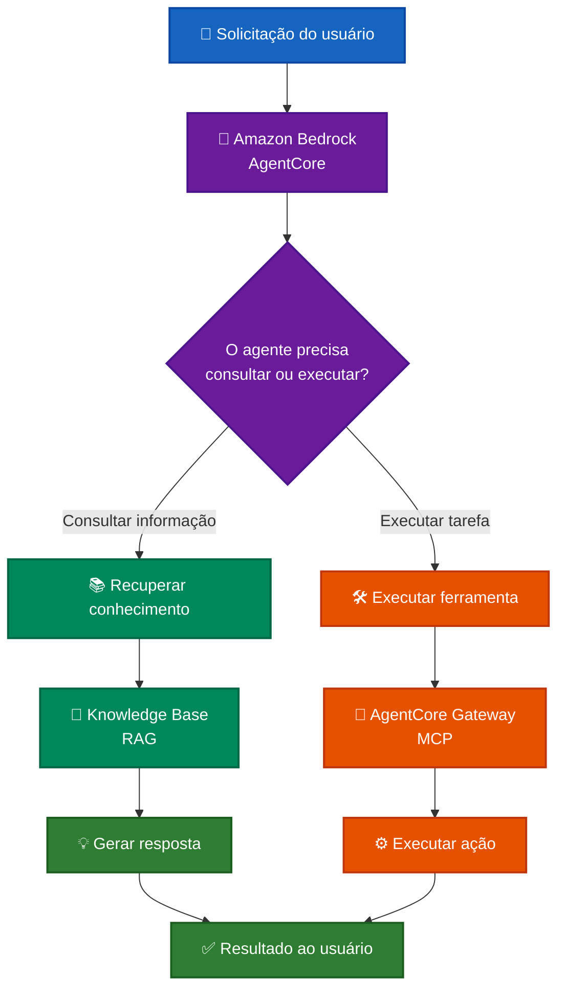
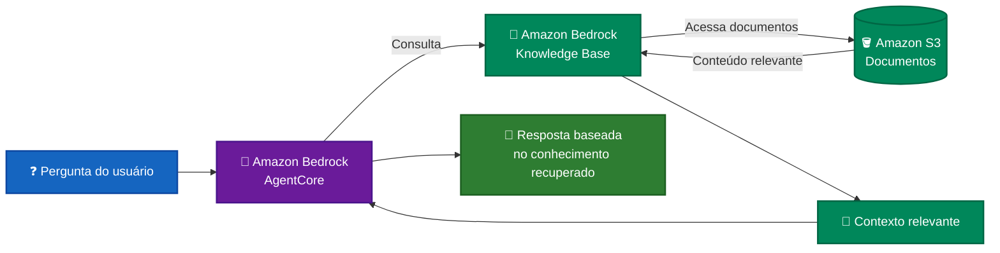
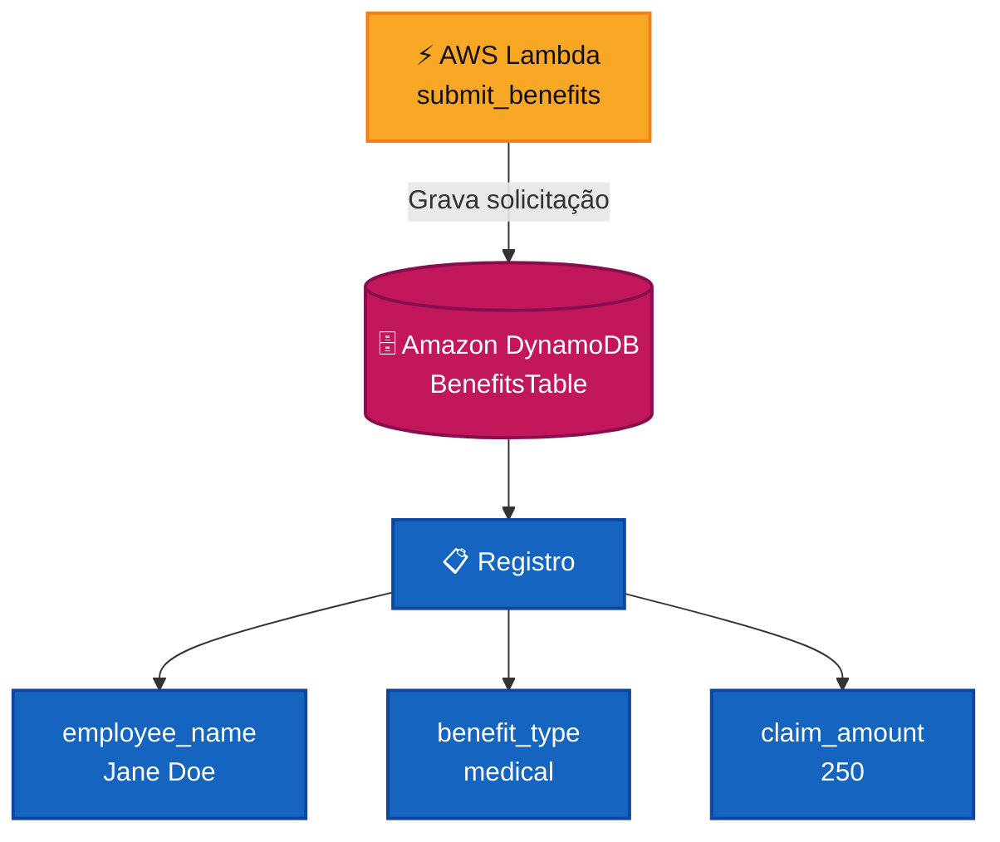
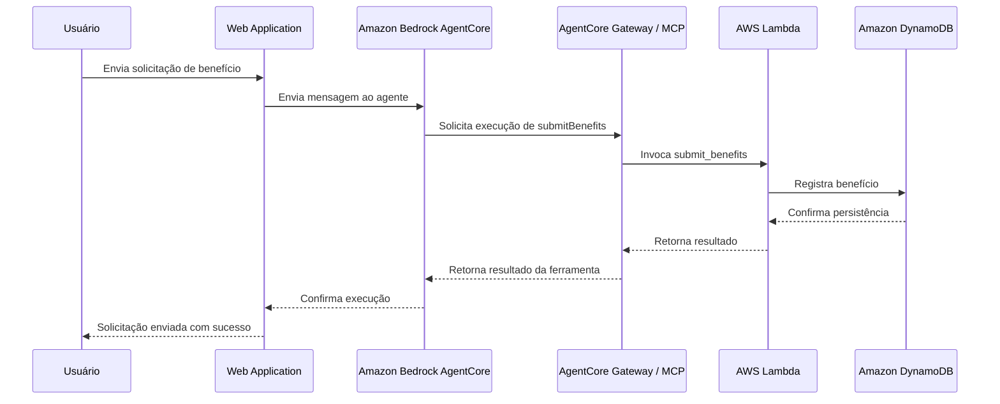
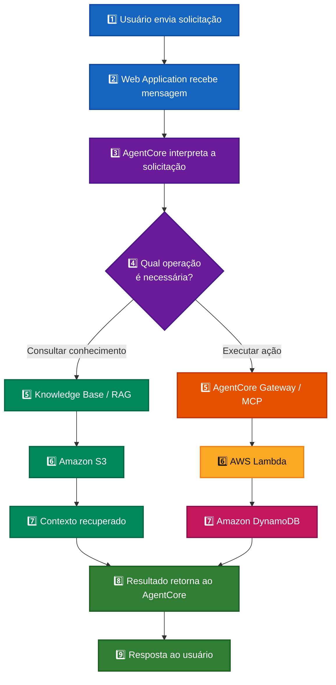
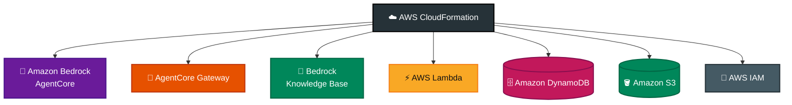

# 🤖 AWS GenAI Smart Assistant Lab


Laboratório hands-on de **Inteligência Artificial Generativa na AWS**, realizado no **AWS SimuLearn** durante o programa **AWS re/Start**.

O laboratório teve como objetivo configurar, integrar e validar um **assistente inteligente de RH** capaz de consultar uma base de conhecimento e executar ações por meio de serviços de IA, serverless, integração e persistência da AWS.

---

## 📑 Sumário

- [🎯 Objetivo](#-objetivo)
- [🏗️ Arquitetura](#️-arquitetura)
  - [Arquitetura geral da solução](#arquitetura-geral-da-solução)
- [☁️ Serviços e tecnologias](#️-serviços-e-tecnologias)
- [🧠 IA Generativa e agentes de IA](#-ia-generativa-e-agentes-de-ia)
- [🔎 Knowledge Base e RAG](#-knowledge-base-e-rag)
- [🔌 AgentCore Gateway e MCP](#-agentcore-gateway-e-mcp)
- [📄 Schema da ferramenta](#-schema-da-ferramenta)
- [⚡ AWS Lambda](#-aws-lambda)
- [🗄️ Amazon DynamoDB](#️-amazon-dynamodb)
- [💬 Validação pelo assistente](#-validação-pelo-assistente)
- [🔄 Fluxo end-to-end](#-fluxo-end-to-end)
- [☁️ Infraestrutura do laboratório](#️-infraestrutura-do-laboratório)
- [🧪 Atividades hands-on realizadas](#-atividades-hands-on-realizadas)
- [✅ Resultado final](#-resultado-final)
- [💡 Principais aprendizados](#-principais-aprendizados)
- [🎓 Contexto do projeto](#-contexto-do-projeto)
- [📚 AWS re/Start](#-aws-restart)
- [🔐 Segurança](#-segurança)
- [⚠️ Observação](#️-observação)
- [🚀 Próximos passos](#-próximos-passos)
- [🧩 Competências demonstradas](#-competências-demonstradas)
- [👨‍💻 Autor](#-autor)
- [⭐ Sobre este repositório](#-sobre-este-repositório)

---

---

## 🎯 Objetivo

Configurar e validar uma arquitetura de assistente de IA capaz de:

- responder perguntas utilizando uma base de conhecimento;
- recuperar informações através de RAG;
- conectar o agente a ferramentas externas;
- utilizar MCP para integração entre agente e serviços;
- executar funções AWS Lambda;
- registrar solicitações no Amazon DynamoDB;
- utilizar arquivos e schemas armazenados no Amazon S3;
- validar o funcionamento completo da solução de ponta a ponta.

---

# 🏗️ Arquitetura

## Arquitetura geral da solução

```mermaid
flowchart LR

    USER["👤 Usuário"]
    WEB["💬 Web Application<br/>HR Assistant"]

    AGENT["🤖 Amazon Bedrock<br/>AgentCore"]

    KB["🧠 Amazon Bedrock<br/>Knowledge Base"]
    S3KB[("🪣 Amazon S3<br/>Knowledge Base")]

    GATEWAY["🔌 Amazon Bedrock<br/>AgentCore Gateway"]

    MCP["🔗 MCP<br/>Model Context Protocol"]

    LAMBDA["⚡ AWS Lambda<br/>submit_benefits"]

    DB[("🗄️ Amazon DynamoDB<br/>BenefitsTable")]

    USER -->|"Acessa"| WEB
    WEB -->|"Envia solicitação"| AGENT

    AGENT -->|"Recupera conhecimento"| KB
    KB -->|"Acessa documentos"| S3KB

    AGENT -->|"Executa ferramenta"| GATEWAY
    GATEWAY -->|"MCP"| MCP
    MCP -->|"Invoca função"| LAMBDA

    LAMBDA -->|"Grava dados"| DB

    classDef user fill:#1565C0,stroke:#0D47A1,color:#ffffff,stroke-width:2px
    classDef ai fill:#6A1B9A,stroke:#4A148C,color:#ffffff,stroke-width:2px
    classDef knowledge fill:#00875A,stroke:#006644,color:#ffffff,stroke-width:2px
    classDef integration fill:#E65100,stroke:#BF360C,color:#ffffff,stroke-width:2px
    classDef compute fill:#F9A825,stroke:#F57F17,color:#111111,stroke-width:2px
    classDef database fill:#C2185B,stroke:#880E4F,color:#ffffff,stroke-width:2px

    class USER,WEB user
    class AGENT ai
    class KB,S3KB knowledge
    class GATEWAY,MCP integration
    class LAMBDA compute
    class DB database
```



### Legenda da arquitetura

| Cor | Responsabilidade |
|---|---|
| 🔵 Azul | Usuário e interface |
| 🟣 Roxo | Inteligência Artificial / AgentCore |
| 🟢 Verde | Knowledge Base, RAG e S3 |
| 🟠 Laranja | Gateway e MCP |
| 🟡 Amarelo | Processamento serverless com Lambda |
| 🩷 Rosa | Persistência no DynamoDB |

---

# ☁️ Serviços e tecnologias

Durante o laboratório foram utilizados conceitos e serviços relacionados a:

- Amazon Bedrock AgentCore
- Amazon Bedrock AgentCore Gateway
- Amazon Bedrock Knowledge Base
- RAG — Retrieval-Augmented Generation
- MCP — Model Context Protocol
- AWS Lambda
- Amazon DynamoDB
- Amazon S3
- AWS CloudFormation
- AWS IAM
- Aplicação Web / Chat
- Arquitetura Serverless
- Integração entre serviços AWS

---

# 🧠 IA Generativa e agentes de IA

A arquitetura demonstra um padrão no qual o assistente não atua apenas como chatbot.

O agente pode seguir dois caminhos principais:

1. **recuperar conhecimento**;
2. **executar uma ação através de ferramentas**.



Esse padrão aproxima a solução do conceito de **Agentic AI**, no qual modelos de linguagem são integrados a conhecimento, ferramentas e serviços externos.

---

# 🔎 Knowledge Base e RAG

O Amazon Bedrock Knowledge Base permite utilizar documentos armazenados no Amazon S3 como fonte de conhecimento para o assistente.



Esse padrão é conhecido como **Retrieval-Augmented Generation (RAG)**.

O RAG permite combinar modelos de linguagem com informações externas ou corporativas, fornecendo contexto específico para a geração das respostas.

---

# 🔌 AgentCore Gateway e MCP

Durante a etapa prática foi configurado um destino no **Amazon Bedrock AgentCore Gateway**.

Destino criado:

```text
submitBenefits
```

Função integrada:

```text
submit_benefits
```

Arquitetura da integração:

```mermaid
flowchart LR

    AGENT["🤖 Amazon Bedrock<br/>AgentCore"]

    GATEWAY["🔌 Amazon Bedrock<br/>AgentCore Gateway"]

    TARGET["🎯 Target<br/>submitBenefits"]

    MCP["🔗 MCP<br/>Model Context Protocol"]

    LAMBDA["⚡ AWS Lambda<br/>submit_benefits"]

    DB[("🗄️ Amazon DynamoDB<br/>BenefitsTable")]

    AGENT -->|"Solicita execução"| GATEWAY

    GATEWAY --> TARGET

    TARGET -->|"Disponibiliza ferramenta"| MCP

    MCP -->|"Invoca"| LAMBDA

    LAMBDA -->|"Persistência"| DB

    classDef ai fill:#6A1B9A,stroke:#4A148C,color:#ffffff,stroke-width:2px
    classDef integration fill:#E65100,stroke:#BF360C,color:#ffffff,stroke-width:2px
    classDef compute fill:#F9A825,stroke:#F57F17,color:#111111,stroke-width:2px
    classDef database fill:#C2185B,stroke:#880E4F,color:#ffffff,stroke-width:2px

    class AGENT ai
    class GATEWAY,TARGET,MCP integration
    class LAMBDA compute
    class DB database
```



O **Model Context Protocol (MCP)** permite disponibilizar ferramentas e recursos externos para agentes através de uma interface padronizada.

---

# 📄 Schema da ferramenta

Para disponibilizar a função ao AgentCore Gateway, foi utilizado um schema armazenado no Amazon S3.

Arquivo utilizado:

```text
submit_benefits.json
```


O schema define a estrutura esperada pela ferramenta e permite que o Gateway disponibilize corretamente a função ao agente.

---

# ⚡ AWS Lambda

A função AWS Lambda utilizada no laboratório foi:

```text
submit_benefits
```

Ela foi integrada ao AgentCore Gateway para processar solicitações de benefícios enviadas pelo assistente.

```mermaid
flowchart LR

    REQUEST["📨 Solicitação<br/>de benefício"]

    AGENT["🤖 AgentCore"]

    GATEWAY["🔌 Gateway / MCP"]

    LAMBDA["⚡ AWS Lambda<br/>submit_benefits"]

    PROCESS["⚙️ Processamento"]

    DB[("🗄️ DynamoDB<br/>BenefitsTable")]

    CONFIRM["✅ Confirmação"]

    REQUEST --> AGENT

    AGENT --> GATEWAY

    GATEWAY --> LAMBDA

    LAMBDA --> PROCESS

    PROCESS -->|"Grava dados"| DB

    DB --> CONFIRM

    classDef input fill:#1565C0,stroke:#0D47A1,color:#ffffff,stroke-width:2px
    classDef ai fill:#6A1B9A,stroke:#4A148C,color:#ffffff,stroke-width:2px
    classDef integration fill:#E65100,stroke:#BF360C,color:#ffffff,stroke-width:2px
    classDef compute fill:#F9A825,stroke:#F57F17,color:#111111,stroke-width:2px
    classDef database fill:#C2185B,stroke:#880E4F,color:#ffffff,stroke-width:2px
    classDef result fill:#2E7D32,stroke:#1B5E20,color:#ffffff,stroke-width:2px

    class REQUEST input
    class AGENT ai
    class GATEWAY integration
    class LAMBDA,PROCESS compute
    class DB database
    class CONFIRM result
```



Esse fluxo demonstra como um agente pode utilizar uma função **serverless** para executar uma ação externa.

---

# 🗄️ Amazon DynamoDB

Após a execução da função Lambda, os dados foram persistidos na tabela:

```text
BenefitsTable
```

Durante a validação do laboratório foi confirmado um registro contendo:

```text
employee_name: Jane Doe
benefit_type: medical
claim_amount: 250
```

Representação da persistência:



A presença desse registro confirmou que a solicitação percorreu corretamente a arquitetura até a camada de persistência.

---

# 💬 Validação pelo assistente

A solução foi testada através da interface de chat disponibilizada no laboratório.

Solicitação utilizada durante a validação:

```text
Enviar uma solicitação de benefícios para Jane Doe,
assistência médica, no valor de R$ 250.
```

Fluxo de execução:



O assistente confirmou o processamento da solicitação e o registro foi posteriormente verificado diretamente no DynamoDB.

---

# 🔄 Fluxo end-to-end

O funcionamento completo da solução pode ser representado da seguinte forma:



---

# ☁️ Infraestrutura do laboratório

Parte da infraestrutura utilizada no laboratório foi provisionada automaticamente pelo ambiente AWS SimuLearn.

O AWS CloudFormation permitiu visualizar os recursos criados e suas integrações.



---

# 🧪 Atividades hands-on realizadas

Durante o laboratório:

- explorei a arquitetura de uma solução de IA Generativa na AWS;
- utilizei Amazon Bedrock AgentCore;
- trabalhei com Amazon Bedrock Knowledge Base;
- analisei o funcionamento de RAG;
- configurei um destino no AgentCore Gateway;
- utilizei MCP para integração entre agente e ferramenta;
- conectei o Gateway a uma função AWS Lambda;
- utilizei um schema armazenado no Amazon S3;
- configurei o destino `submitBenefits`;
- integrei a função `submit_benefits`;
- utilizei a aplicação de chat do laboratório;
- enviei uma solicitação através do assistente;
- validei a execução da ação;
- consultei os dados no Amazon DynamoDB;
- confirmei a persistência na `BenefitsTable`;
- acompanhei os recursos provisionados pelo AWS CloudFormation;
- validei o fluxo completo da solução.

---

# ✅ Resultado final

O laboratório foi concluído e validado com sucesso no **AWS SimuLearn**.


A solicitação enviada pelo assistente foi processada corretamente e o registro correspondente foi confirmado no DynamoDB.

---

# 💡 Principais aprendizados

O laboratório proporcionou prática em conceitos relacionados a:

- Inteligência Artificial Generativa;
- agentes de IA;
- Amazon Bedrock;
- Amazon Bedrock AgentCore;
- AgentCore Gateway;
- RAG;
- Knowledge Bases;
- MCP;
- integração de agentes com ferramentas;
- AWS Lambda;
- arquiteturas serverless;
- Amazon DynamoDB;
- Amazon S3;
- bancos NoSQL;
- persistência de dados;
- integração entre serviços AWS;
- AWS IAM;
- AWS CloudFormation;
- execução de ações através de agentes;
- validação end-to-end de aplicações de IA.

---

# 🎓 Contexto do projeto

Este projeto foi realizado em um **ambiente hands-on de laboratório AWS SimuLearn**, como parte do processo de aprendizagem em cloud e Inteligência Artificial.

O laboratório disponibilizou uma arquitetura e parte dos recursos previamente preparados.

A atividade prática envolveu:

**configuração → integração → execução → troubleshooting → validação**

dos componentes da solução.

Este repositório representa, portanto, **experiência prática em ambiente de laboratório AWS**, e não uma aplicação comercial implantada em produção.

---

# 📚 AWS re/Start

O laboratório faz parte da experiência prática desenvolvida durante o programa **AWS re/Start**, complementando estudos e atividades relacionados a:

- Amazon EC2
- Amazon VPC
- Amazon S3
- Amazon EBS
- AWS IAM
- AWS Lambda
- Amazon CloudWatch
- Amazon Route 53
- AWS CloudFormation
- AWS CLI
- redes em cloud
- segurança
- armazenamento
- automação
- troubleshooting
- arquitetura AWS
- alta disponibilidade
- boas práticas de cloud
- Inteligência Artificial Generativa na AWS

---

# 🔐 Segurança

Por segurança, informações sensíveis do ambiente do laboratório não são publicadas neste repositório.

Não são disponibilizados:

- IDs de contas AWS;
- credenciais;
- tokens;
- Access Keys;
- Secret Access Keys;
- sessões temporárias;
- ARNs completos contendo identificadores da conta;
- URLs temporárias do AWS Labs;
- usuários temporários;
- arquivos internos restritos do laboratório.

As evidências visuais utilizadas no portfólio devem ser revisadas ou anonimizadas antes da publicação.

---

# ⚠️ Observação

Este repositório possui finalidade **educacional e de portfólio**.

Ele documenta atividades e conhecimentos adquiridos durante um laboratório hands-on no AWS SimuLearn.

Não representa uma infraestrutura AWS comercial ou um ambiente de produção.

---

# 🚀 Próximos passos

Como evolução deste aprendizado:

- desenvolver uma aplicação própria utilizando Amazon Bedrock;
- criar uma Knowledge Base própria;
- implementar RAG com dados personalizados;
- desenvolver funções Lambda próprias;
- criar APIs serverless;
- adicionar observabilidade com Amazon CloudWatch;
- implementar autenticação e autorização;
- utilizar infraestrutura como código;
- implementar CI/CD;
- aplicar segurança a soluções de IA;
- monitorar latência, erros e custos;
- realizar deploy de uma solução própria de IA na AWS.

---

# 🧩 Competências demonstradas

**GenAI • RAG • AI Agents • Amazon Bedrock • AgentCore • MCP • AWS Lambda • DynamoDB • Amazon S3 • CloudFormation • IAM • Serverless • Cloud Computing**

---

# 👨‍💻 Autor

**Rogério Augusto Sabino**

**Engenharia de IA & Dados**

GenAI • RAG • LLMs • Python • Machine Learning • AWS • OCI

GitHub: [Rogerio5](https://github.com/Rogerio5)

LinkedIn: [Rogério Augusto Sabino](https://www.linkedin.com/in/rogerio-augusto-sabino/)

---

# ⭐ Sobre este repositório

Este repositório faz parte do meu portfólio de estudos e projetos voltados para:

**Inteligência Artificial • IA Generativa • Engenharia de Dados • Cloud Computing • Engenharia de Software**

O objetivo é documentar experiências práticas e demonstrar evolução na construção, integração e validação de soluções modernas de Inteligência Artificial.
