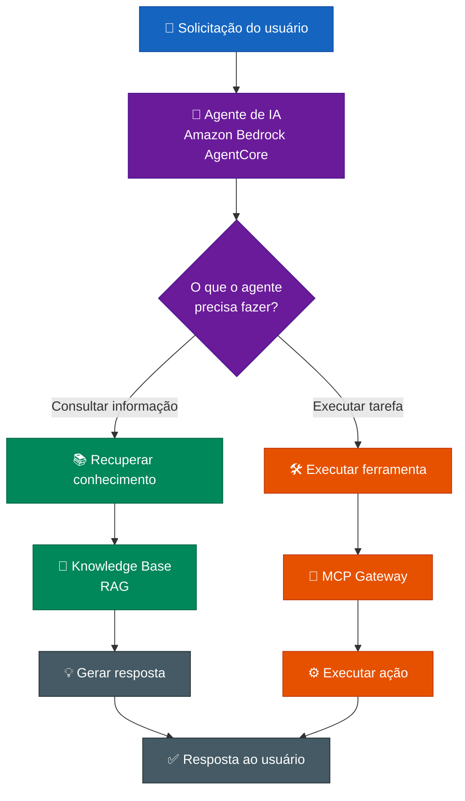
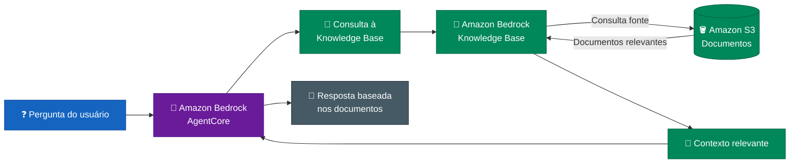
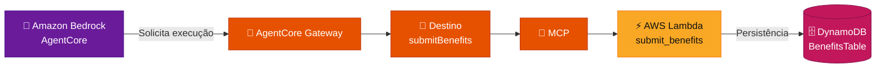
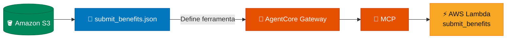
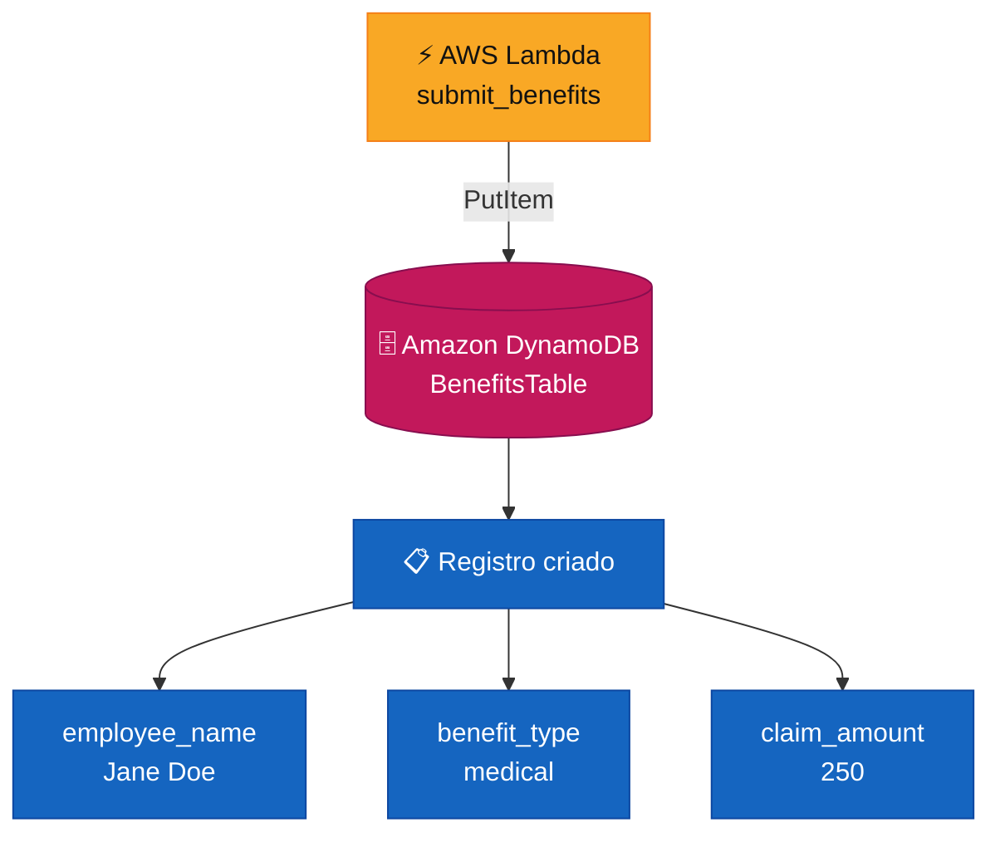
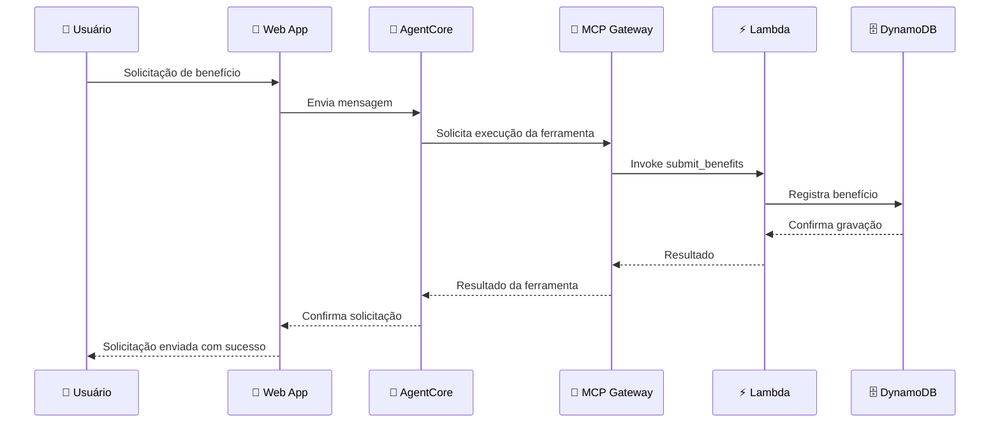
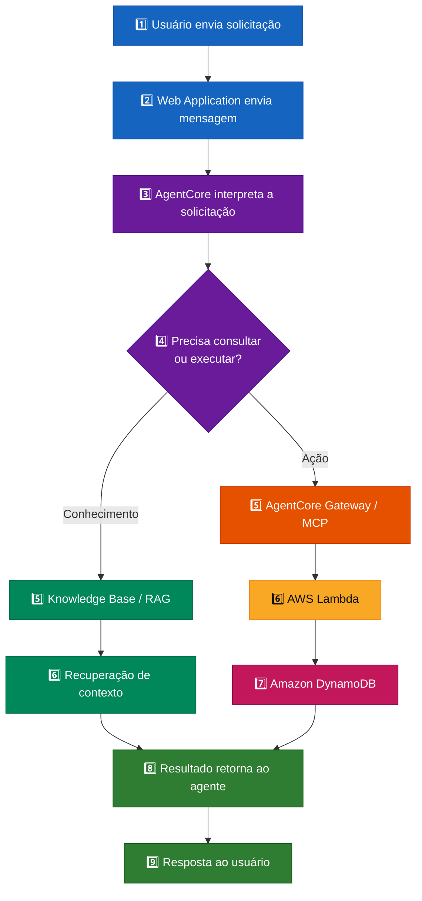
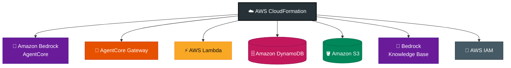

# 🤖 AWS GenAI Smart Assistant Lab


Laboratório hands-on de **Inteligência Artificial Generativa na AWS**, realizado no **AWS SimuLearn** durante o programa **AWS re/Start**.

O laboratório teve como objetivo configurar e validar um **assistente inteligente de RH** capaz de consultar uma base de conhecimento e executar ações por meio da integração entre serviços de IA, serverless e armazenamento da AWS.

---

## 🎯 Objetivo

Configurar e validar uma arquitetura de assistente de IA capaz de:

- responder perguntas utilizando uma base de conhecimento;
- recuperar informações por meio de RAG;
- conectar o agente a ferramentas externas;
- utilizar MCP para integração entre agente e serviços;
- executar funções AWS Lambda;
- registrar solicitações no Amazon DynamoDB;
- utilizar arquivos armazenados no Amazon S3;
- validar o funcionamento completo da solução.

---

## 🏗️ Arquitetura da solução

A arquitetura combina **IA Generativa, recuperação de conhecimento e execução de ações**, permitindo que o assistente não apenas responda perguntas, mas também interaja com outros serviços.

```mermaid
flowchart LR

    USER["👤 Usuário"]
    WEB["💬 Web Application<br/>HR Assistant"]

    AGENT["🤖 Amazon Bedrock<br/>AgentCore"]

    KB["🧠 Amazon Bedrock<br/>Knowledge Base"]
    S3KB[("🪣 Amazon S3<br/>Knowledge Base")]

    GATEWAY["🔌 Amazon Bedrock<br/>AgentCore Gateway"]
    MCP["🔗 MCP<br/>Model Context Protocol"]

    LAMBDA["⚡ AWS Lambda<br/>submit_benefits"]

    DB[("🗄️ Amazon DynamoDB<br/>BenefitsTable")]

    USER --> WEB
    WEB --> AGENT

    AGENT -->|"Recuperação de conhecimento"| KB
    KB -->|"Acessa documentos"| S3KB

    AGENT -->|"Executa ferramenta"| GATEWAY
    GATEWAY --> MCP
    MCP --> LAMBDA

    LAMBDA -->|"Grava solicitação"| DB

    classDef user fill:#1565C0,stroke:#0D47A1,color:#ffffff,stroke-width:2px
    classDef ai fill:#6A1B9A,stroke:#4A148C,color:#ffffff,stroke-width:2px
    classDef knowledge fill:#00875A,stroke:#006644,color:#ffffff,stroke-width:2px
    classDef integration fill:#E65100,stroke:#BF360C,color:#ffffff,stroke-width:2px
    classDef compute fill:#F9A825,stroke:#F57F17,color:#111111,stroke-width:2px
    classDef database fill:#C2185B,stroke:#880E4F,color:#ffffff,stroke-width:2px

    class USER,WEB user
    class AGENT ai
    class KB,S3KB knowledge
    class GATEWAY,MCP integration
    class LAMBDA compute
    class DB database
```



---

## ☁️ Serviços e tecnologias

Durante o laboratório foram utilizados conceitos e serviços relacionados a:

- Amazon Bedrock AgentCore
- Amazon Bedrock AgentCore Gateway
- Amazon Bedrock Knowledge Base
- RAG — Retrieval-Augmented Generation
- MCP — Model Context Protocol
- AWS Lambda
- Amazon DynamoDB
- Amazon S3
- AWS CloudFormation
- AWS IAM
- Aplicação Web / Chat
- Arquitetura Serverless
- Integração entre serviços AWS

---

## 🧠 IA Generativa e agentes de IA

A arquitetura demonstra que o assistente não atua apenas como chatbot. O agente pode recuperar conhecimento e também executar ações externas.



Essa arquitetura permite que o modelo de linguagem seja integrado a recursos externos em vez de funcionar apenas como um chatbot isolado.

---


## 🔎 Knowledge Base e RAG

O Amazon Bedrock Knowledge Base permite recuperar informações armazenadas no Amazon S3 para fornecer contexto ao agente.




Esse padrão é conhecido como **Retrieval-Augmented Generation (RAG)**.

O RAG permite combinar modelos de linguagem com informações externas ou corporativas, aumentando a capacidade do assistente de responder utilizando um contexto específico.

---

## 🔌 Integração com MCP

Durante o laboratório, foi configurado um destino chamado `submitBenefits` no AgentCore Gateway.



utilizando o **Model Context Protocol (MCP)**.

O MCP permite disponibilizar ferramentas e recursos externos para agentes de IA através de uma interface padronizada.

---

## 📄 Schema da ferramenta

O AgentCore Gateway utiliza um schema armazenado no Amazon S3 para compreender a estrutura da ferramenta disponível ao agente.



---

## ⚡ Execução da AWS Lambda

A função `submit_benefits` processa a solicitação recebida pelo agente e grava os dados no DynamoDB.

```mermaid
flowchart LR

    REQUEST["📨 Solicitação de benefício"]

    AGENT["🤖 AgentCore"]

    MCP["🔗 MCP Gateway"]

    LAMBDA["⚡ AWS Lambda<br/>submit_benefits"]

    PROCESS["⚙️ Processamento<br/>da solicitação"]

    DB[("🗄️ DynamoDB<br/>BenefitsTable")]

    CONFIRM["✅ Confirmação<br/>ao assistente"]

    REQUEST --> AGENT
    AGENT --> MCP
    MCP --> LAMBDA
    LAMBDA --> PROCESS
    PROCESS --> DB
    DB --> CONFIRM

    classDef input fill:#1565C0,stroke:#0D47A1,color:#ffffff
    classDef ai fill:#6A1B9A,stroke:#4A148C,color:#ffffff
    classDef integration fill:#E65100,stroke:#BF360C,color:#ffffff
    classDef compute fill:#F9A825,stroke:#F57F17,color:#111111
    classDef database fill:#C2185B,stroke:#880E4F,color:#ffffff
    classDef result fill:#2E7D32,stroke:#1B5E20,color:#ffffff

    class REQUEST input
    class AGENT ai
    class MCP integration
    class LAMBDA,PROCESS compute
    class DB database
    class CONFIRM result
```



Esse processo demonstra como agentes de IA podem utilizar funções serverless para executar ações dentro de uma aplicação.

---

## 🗄️ Persistência no DynamoDB

O resultado da execução da função Lambda foi registrado na tabela `BenefitsTable`.



A presença desse registro confirmou que a chamada realizada pelo assistente percorreu corretamente a arquitetura até a camada de persistência.

---

## 💬 Validação pelo assistente

O fluxo foi testado através da aplicação de chat fornecida no laboratório.



O assistente confirmou o processamento da solicitação e o registro correspondente foi posteriormente verificado no DynamoDB.

---

## 🔄 Fluxo end-to-end

A execução completa do laboratório pode ser representada da seguinte maneira:



---

## ☁️ Infraestrutura do laboratório

Os recursos utilizados no laboratório foram provisionados através da infraestrutura preparada para o AWS SimuLearn.




---

## ✅ Resultado final

O laboratório foi validado com sucesso.


A solicitação enviada pelo assistente foi processada corretamente e o registro foi confirmado no DynamoDB.

---

## 💡 Principais aprendizados

O laboratório proporcionou prática em conceitos relacionados a:

- Inteligência Artificial Generativa;
- agentes de IA;
- Amazon Bedrock;
- Amazon Bedrock AgentCore;
- RAG;
- Knowledge Bases;
- MCP;
- integração de agentes com ferramentas;
- AWS Lambda;
- arquiteturas serverless;
- Amazon DynamoDB;
- Amazon S3;
- bancos de dados NoSQL;
- persistência de dados;
- integração entre serviços AWS;
- IAM;
- CloudFormation;
- execução de ações por agentes;
- validação end-to-end de aplicações de IA.

---

## 🔄 Fluxo de dados

Uma das principais práticas observadas no laboratório foi compreender como os diferentes componentes trabalham em conjunto.

```text
1. Usuário envia uma solicitação
               │
               ▼
2. Aplicação envia a mensagem ao agente
               │
               ▼
3. AgentCore interpreta a solicitação
               │
               ├────► Knowledge Base / RAG
               │
               ▼
4. Agente identifica necessidade de executar ação
               │
               ▼
5. AgentCore Gateway disponibiliza ferramenta
               │
               ▼
6. MCP conecta o agente à ferramenta
               │
               ▼
7. AWS Lambda processa a solicitação
               │
               ▼
8. DynamoDB armazena os dados
               │
               ▼
9. Resultado é retornado ao usuário
```

---

## 🎓 Contexto do projeto

Este projeto foi realizado em um **ambiente hands-on de laboratório AWS SimuLearn**, como parte do processo de aprendizagem em cloud e Inteligência Artificial.

O laboratório disponibilizou uma arquitetura e recursos previamente preparados, enquanto a atividade prática envolveu **configuração, integração, execução e validação dos componentes da solução**.

Portanto, este repositório representa experiência prática em laboratório e não uma aplicação comercial implantada em ambiente de produção.

---

## 📚 AWS re/Start

O laboratório faz parte da experiência prática desenvolvida durante o programa **AWS re/Start**, complementando estudos e atividades relacionados a:

- Amazon EC2
- Amazon VPC
- Amazon S3
- Amazon EBS
- AWS IAM
- AWS Lambda
- Amazon CloudWatch
- Amazon Route 53
- AWS CloudFormation
- AWS CLI
- redes em cloud
- segurança
- armazenamento
- automação
- troubleshooting
- arquitetura AWS
- alta disponibilidade
- boas práticas de cloud
- Inteligência Artificial Generativa na AWS

---

## 🔐 Segurança

Por segurança, informações sensíveis do ambiente de laboratório não são publicadas neste repositório.

Não são disponibilizados:

- IDs de contas AWS;
- credenciais;
- tokens;
- chaves de acesso;
- sessões temporárias;
- ARNs completos contendo identificadores da conta;
- URLs temporárias do AWS Labs;
- usuários temporários;
- arquivos internos restritos do laboratório.

As evidências utilizadas no portfólio devem ser revisadas ou anonimizadas antes de serem publicadas.

---

## ⚠️ Observação

Este repositório possui finalidade **educacional e de portfólio**.

Ele documenta as atividades e os conhecimentos adquiridos durante um laboratório hands-on da AWS.

Não representa uma implementação comercial ou uma infraestrutura AWS utilizada em produção.

---

## 🚀 Próximos passos

Como evolução dos estudos, alguns pontos que podem ser explorados são:

- desenvolvimento de uma aplicação própria utilizando Amazon Bedrock;
- criação de uma Knowledge Base própria;
- implementação de RAG com dados personalizados;
- desenvolvimento de funções Lambda próprias;
- criação de APIs serverless;
- observabilidade com Amazon CloudWatch;
- autenticação e autorização com IAM;
- infraestrutura como código;
- CI/CD;
- segurança de aplicações de IA;
- monitoramento;
- controle de custos;
- deploy de soluções de IA na AWS.

---

## 🧩 Competências demonstradas

Este laboratório contribui para demonstrar prática em:

**GenAI • RAG • AI Agents • Amazon Bedrock • AgentCore • MCP • AWS Lambda • DynamoDB • S3 • CloudFormation • Serverless • Cloud Computing**

---

## 👨‍💻 Autor

**Rogério Augusto Sabino**

Engenharia de IA & Dados  
GenAI • RAG • LLMs • Python • Machine Learning • AWS • OCI

GitHub: [Rogerio5](https://github.com/Rogerio5)

LinkedIn: [Rogério Augusto Sabino](https://www.linkedin.com/in/rogerio-augusto-sabino/)

---

## ⭐ Sobre este repositório

Este repositório faz parte do meu portfólio de estudos e projetos voltados para **Inteligência Artificial, IA Generativa, Engenharia de Dados, Cloud Computing e Engenharia de Software**.

O objetivo é documentar experiências práticas e demonstrar a evolução na construção e integração de soluções modernas de IA.
